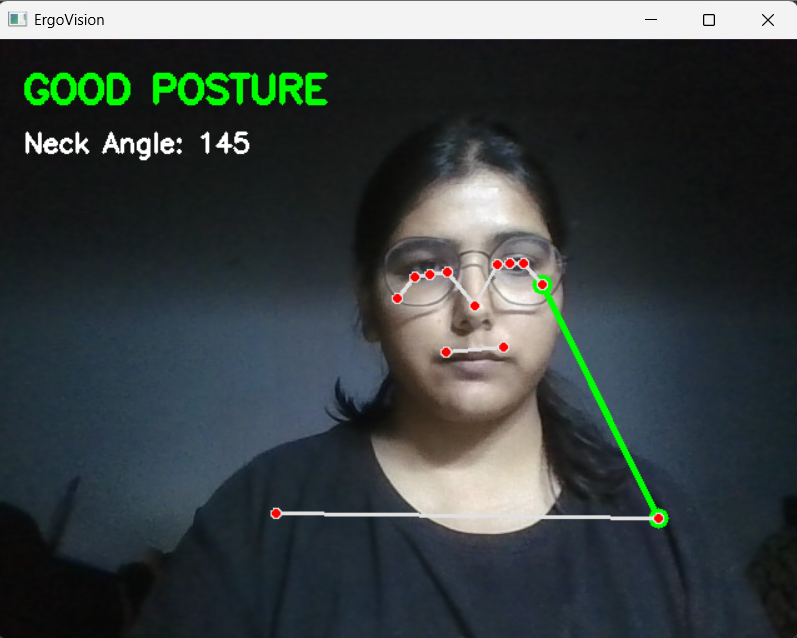
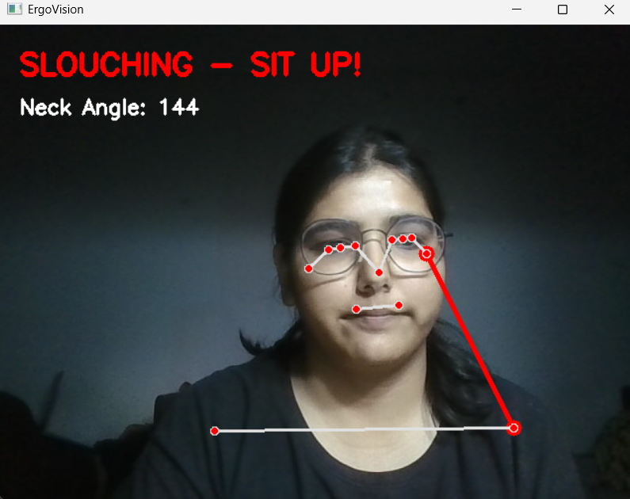

# ErgoVision – Posture Detection System

ErgoVision is a computer vision project that monitors a user's sitting posture using a webcam and detects slouching in real time.

The system uses **MediaPipe Pose** to detect body landmarks and calculates the **neck angle using the ear, shoulder, and hip points** to determine whether the user has good posture or is slouching.

This project runs **entirely from the command line** and does not require any IDE or GUI-based setup.

---

# Project Features

* Real-time posture monitoring using webcam
* Detects slouching posture
* Displays posture status on the screen
* Calculates neck angle using ear, shoulder, and hip landmarks
* Visual skeleton tracking using MediaPipe Pose

---

# Technologies Used

* Python
* OpenCV
* MediaPipe
* NumPy

---

# System Requirements

Before running the project, ensure the following are installed:

* Python **3.9 or later**
* A working **webcam**
* Internet connection (for installing dependencies)

The program is designed to run **directly from a terminal environment**.

---

# Project Structure

ErgoVision/

posture_monitor.py → Main posture detection program
requirements.txt → Project dependencies
README.md → Project documentation
screenshots/ → Demo images

---

# Project Setup Instructions

Follow these steps to set up and run the project.

## Step 1: Clone the Repository

Open a terminal and run:

git clone https://github.com/MahiSaxena/ErgoVision.git

Navigate into the project folder:

cd ErgoVision

---

## Step 2: Install Dependencies

Install all required libraries using:

pip install -r requirements.txt

---

## Step 3: Run the Program

Run the program directly from the terminal:

python posture_monitor.py

When the program starts:

1. Your webcam will activate.
2. The system will detect body landmarks.
3. Your posture status will be displayed on screen.

Press **Q** to exit the program.

---

# How the System Works

1. The webcam captures live video input.
2. MediaPipe detects body landmarks from the video frame.
3. The program extracts coordinates of:

   * Ear
   * Shoulder
   * Hip
4. The neck angle is calculated using these points.
5. If the angle crosses a threshold, the system detects slouching and displays a warning.

---

# Demo Screenshots

### Good Posture Detection

### Slouching Detection

---

# Troubleshooting

### Webcam does not start

Possible solutions:

1. Make sure no other application (Zoom, Teams, etc.) is using the webcam.
2. Check if your webcam is enabled in system settings.
3. Try restarting the program.

### Module Not Found Error

If you see errors like:

ModuleNotFoundError: No module named 'cv2'

Install dependencies again:

pip install -r requirements.txt

### Webcam window does not appear

Ensure that:

* Your webcam is connected and detected by your system
* Python has permission to access the camera